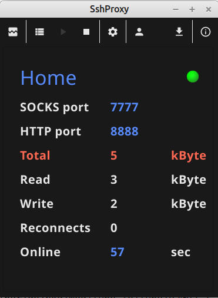
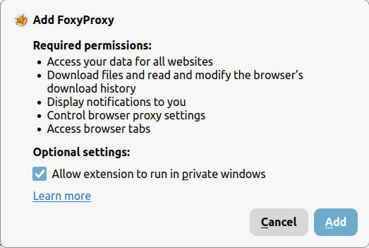
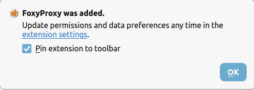
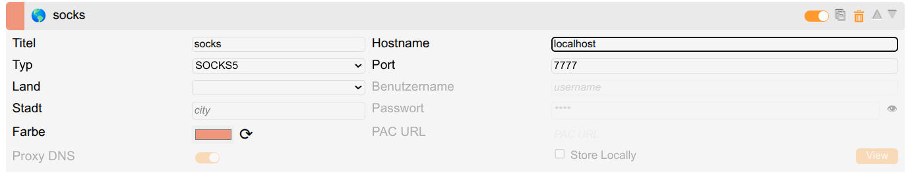
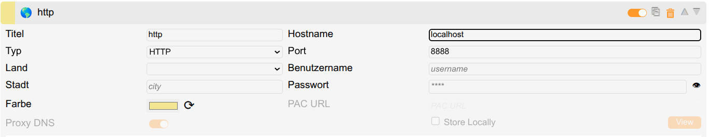
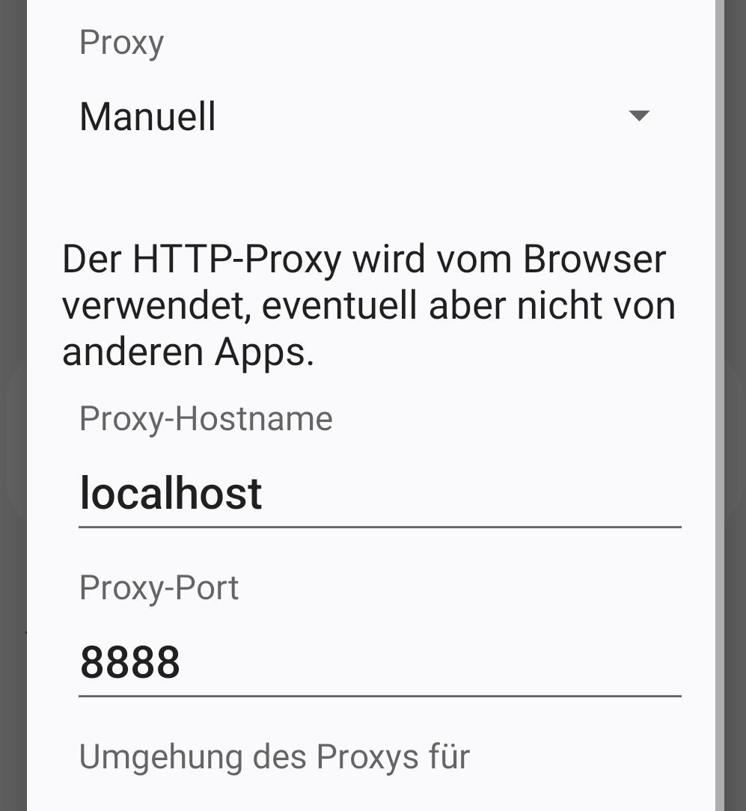

# SshProxy

SshProxy makes a SSH connection to a SSH server. Then it offers 2 proxies for tunneling traffic over the SSH connection.  

1. SOCKS proxy (TCP only)  
2. HTTP proxy  

SshProxy is written in [Go](https://go.dev/) and uses [Fyne](https://fyne.io/) as graphical toolkit.

## Use cases for SshProxy

1. You are not at home and want to surf with your home IP address.  
2. You want allow someone else to browse with your IP address.  
3. You want to connect to HTTP servers in an internal network when you are external and have no direkt VPN access.

## Differences to VPN

1. You use your own server - you can access conten from your internal network
2. You use your private IP address - VPN IP address are often banned

## Screenshots

## Security

- All data from the proxy to the SSH server are encrypted.
- The target of your browsing does not see where you are - it always sees your local home based IP
- Use host keys !!! This prevents you from Man-in-the-Middle-attack.
- Do not use user/password for authentication. Use user/SSH key file. For keyfile use strong keys, if possible use Ed25519 instead of RSA.

### Precompiled binaries

#### Linux (64 Bit)

[Tar file](https://github.com/bytemystery-com/sshproxy/releases/download/v0.2.7/SshProxy.tar.xz)  
[Standalone binary](https://github.com/bytemystery-com/sshproxy/releases/download/v0.2.7/SshProxy)  

#### Windows (64 Bit)

[Standalone exe](https://github.com/bytemystery-com/sshproxy/releases/download/v0.2.7/SshProxy.exe)  

#### Mac

Not available - it could be build but requires Mac + SDK.  

#### Android 

[APK all in one](https://github.com/bytemystery-com/sshproxy/releases/download/v0.2.7/SshProxy.apk)  
[APK only 64 bit](https://github.com/bytemystery-com/sshproxy/releases/download/v0.2.7/SshProxy_64.apk)  

### Usage of SshProxy

You need a running and reachable SSH server.  
For this server you have a user name, ssh key, perhaps a password if used without a SSH key file or if
SSH key is password protected. You also have one or more host key files for the server. This file(s) is not needed
but I strongly recommend to use it - so you can be sure you connect really to your server and not to a faked server!  
You also have the hostname (if you operate the server at home you will need a dydns service (e.g.: no-ip) and you have to ensure that the ssh server port is reachable from outside (you need to confure your routers firewall settings)) and port of the SSH server.  
All this informations must be entered in the SshProxy config dialog. There you also specify the port for the SOCK5 server and the HTTP server SshProxy will create. ,

## FoxyProxy installation

Now you must configure your browser to use the proxy. For desktop Firefox / Chrome / Edge search for FoxyProxy Plugin.  
[FoxyProxy for Firefox](https://addons.mozilla.org/en-US/firefox/addon/foxyproxy-standard/)  
  
  
[FoxyProxy for Chrome](https://chromewebstore.google.com/detail/foxyproxy/gcknhkkoolaabfmlnjonogaaifnjlfnp?hl=en&pli=1)  
[FoxyProxy for Microsoft Edge](https://microsoftedge.microsoft.com/addons/detail/foxyproxy/flcnoalcefgkhkinjkffipfdhglnpnem)

## FoxyProxy config

Configure it according to the screenshots. (You will only need to configure SOCKS5 OR HTTP not both!).
If possible use SOCKS5 proxy.  
  
  

For Android there are 2 possibilities.  

1. Use Firefox Browser and FoxyProxy as described above.  
2. If you want to use the default Chrome based browser you can set the proxy in the WLAN settings. This proxy have to be a HTTP proxy - so enter the port for the HTTP server you configured in SshProxy.  
  
3. For mobile data SshProxy can not be used with Chrome on Android because mobile version of Chrome has no seperate proxy settings.  

### Running a SSH server

For running a SSH Server you need a Linux system (real or as VM, as VM ensure that you choose Bridge network or adjust NAT rules).  
In the doc dir [doc](./doc/server) you find a script ./start.sh.  
First time start it with ./start-sh -c &lt;EMAIL&gt; &lt;PASS&gt;  
This creates a user- and a host key files. Then start the server with ./start.sh  

### Statistics

The project consists of round about 2400 lines of go code.  

Author: Reiner Pröls  
Licence: MIT  

© Copyright Reiner Pröls, 2026
