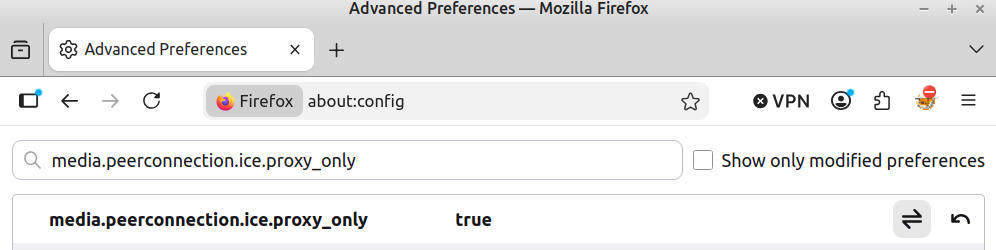
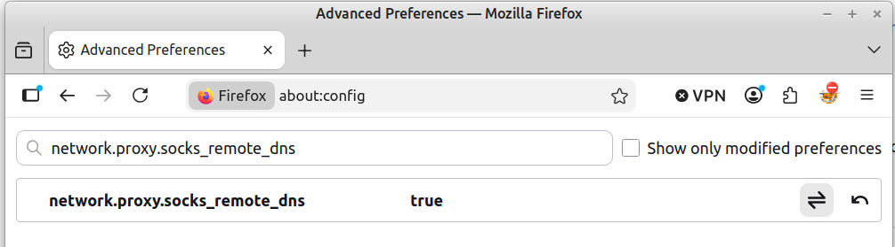
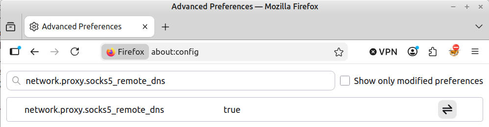
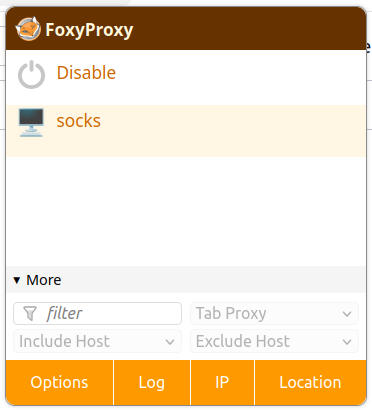
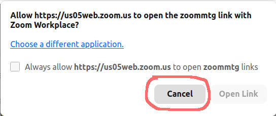
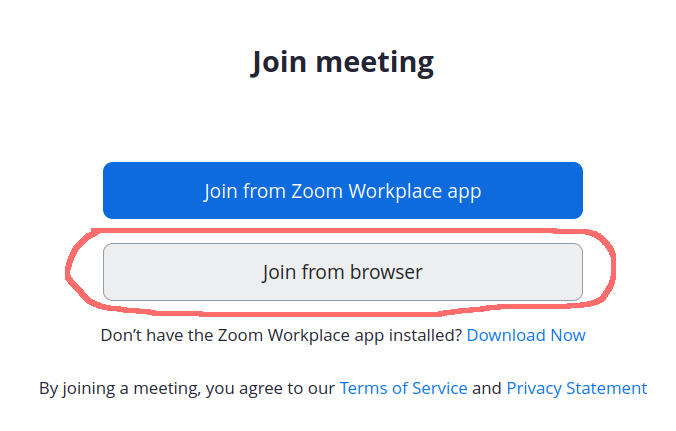
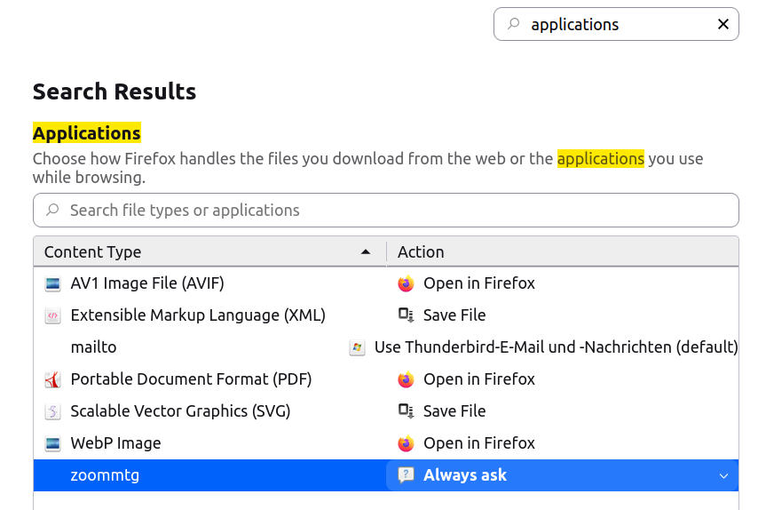

# SshProxy - Zoom

It is possible to use Zoom in a web browser and to use SshProxy.  
Normally Zoom tries to use WebRTC over UDP. But we can only handle TCP traffic.  
So we need a browser which allows us to configure this - Firefox.  
So if not already installed - install [Firefox](https://www.firefox.com)  
Now we need a plugin - [FoxyProxy](https://addons.mozilla.org/en-US/firefox/addon/foxyproxy-standard/)  
Install it as described here [FoxyProxy installation](../../README.md#foxyproxy-installation)  
Configure a SOCKS5 Proxy as described here [FoxyProxy configuration](../../README.md#foxyproxy-config)  

## Configure Firefox  

Now we need to configure Firefox to use WebRTC over our proxy:  
In Firefox type in the address bar **about:config** and press ENTER.  
Now search for:

- **media.peerconnection.ice.proxy_only = true**  
  

- **network.proxy.socks_remote_dns = true**  
  

- **network.proxy.socks5_remote_dns = true**  
  

1. Now restart Firefox  
2. Start SshProxy  
3. Activate the Proxy in Firefox  
  
4. When you receive the Zoom link - open it in the browser - NOT launching the Zoom app !!!  
  
  

If you are not asked to open it in the browser and the Zoom app starts you need the following:  
In Firefox type in the address bar **about:preferences** and press ENTER.  
Now search for **applications**:  
Click on **zoomtg** and change the entry to **Always ask**:  
  

Author: Reiner Pröls  
Licence: MIT  

© Copyright Reiner Pröls, 2026
